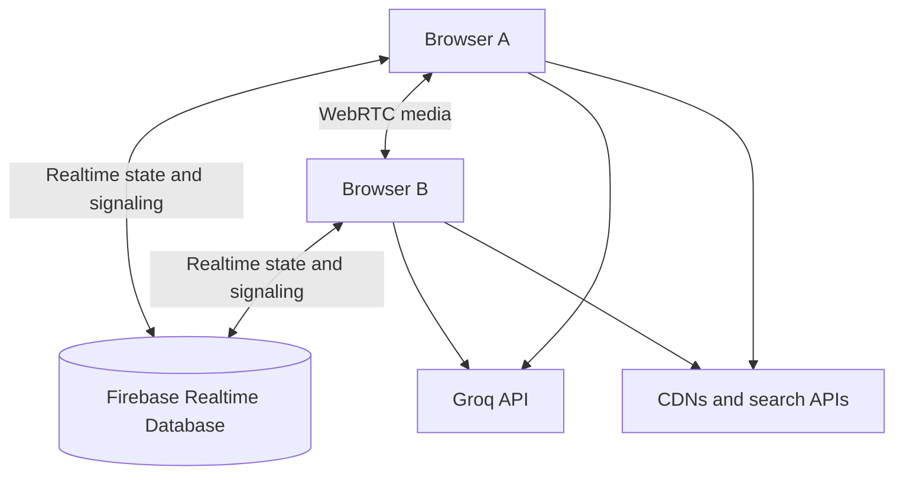

# DuoTrack architecture

DuoTrack is a static, browser-only application. The entire UI, CSS, state model, Firebase integration, AI and YouTube clients, chat, music player, and call logic currently live in `index.html`.

## System overview



GitHub Pages serves the static page. Firebase is the shared state and signaling layer. Voice/video media normally travels directly between browsers through WebRTC rather than through Firebase.

## Runtime components

### Static UI

`index.html` contains:

1. page markup and modal/widget structure;
2. responsive CSS, themes, animations, and embedded SVG artwork;
3. one ES-module script containing application state and integrations.

The file imports Firebase modules from Google's CDN. KaTeX, jsPDF, and fonts are also loaded remotely.

### Shared state

The app uses one configured group under a Firebase Realtime Database tree. The major logical areas are:

```text
duotrack/groups/{groupId}/
├── users/          # Timer, totals, profile, now-playing track, tasks, D-Day, and histories
├── chat/           # Messages, images, edits, replies, and reactions
├── typing/         # Ephemeral typing timestamps
├── accounts/       # Dynamically registered prototype accounts
├── call/           # WebRTC offer, answer, state, and ICE candidates
├── appearance/     # Shared visual preferences
├── grokApiKey      # Shared AI key in the current prototype
└── musicSettings/  # Shared YouTube Music enabled flag and browser API key
```

The exact shape is normalized in the browser before rendering so missing older fields receive defaults.

### Timer model

The timer stores a base duration and a start timestamp instead of writing every second. The browser calculates a live duration from the current time and periodically checkpoints the result to Firebase. A checkpoint is also attempted when the page becomes hidden.

Daily totals are rolled over using an `Asia/Kolkata` date key. Separate maps retain totals by:

- day;
- subject;
- Lecture/Practice mode;
- solved-question count.

Countdown mode reuses the session timer but tracks a target duration and prevents the completion alarm from firing more than once for a session.

### Realtime chat

Firebase listeners keep the message collection and typing state synchronized. Chat records can include:

- sender identity and timestamp;
- plain text;
- compressed image data;
- reply metadata;
- edits;
- reactions.

“Delete for me” is stored locally as a set of hidden message IDs. “Delete for everyone” removes the shared Firebase record.

### Calls

WebRTC handles audio/video tracks. Firebase is used only for signaling:

1. caller writes an offer;
2. callee reads the offer and writes an answer;
3. both sides exchange ICE candidates;
4. browsers establish a peer connection;
5. screen sharing replaces the active outgoing video track.

The current ICE configuration uses public STUN servers and no TURN relay. This is simple, but it cannot guarantee connectivity across all NAT/firewall combinations.

### Study AI

The frontend calls Groq's OpenAI-compatible chat-completions endpoint. It sends a study-oriented instruction, recent conversation context, the question, and optional snippets from public search endpoints. KaTeX renders supported mathematical notation in the response.

This direct-browser architecture is suitable only for a trusted prototype. A production version should put the AI call behind a server or serverless function and keep provider credentials there.

### Study Music

The shared `musicSettings` record controls whether the feature is enabled and stores the YouTube Data API v3 browser key. A live Firebase listener applies configuration changes to both users and stops local playback when the feature is disabled.

Search requests go directly from the browser to the YouTube Data API with `type=video`, music category `10`, and a maximum of ten results. Playback uses the YouTube IFrame Player API. The cassette card and player dialog control the same local player.

Each user's Firebase record can contain a normalized `nowPlaying` value with the video ID, title, HTTPS thumbnail, and playing flag. Player state changes update that record, allowing both browsers to replace the listener's avatar with cover art while music is playing. Firebase carries only this metadata; YouTube serves the media directly.

## Persistence

| Location | Examples | Shared? |
| --- | --- | --- |
| Firebase Realtime Database | User study state, histories, tasks, D-Day, profile image, now-playing metadata, chat, typing, call signaling, registered prototype accounts, shared appearance, AI and YouTube Music configuration | Yes |
| `localStorage` | Remembered session, theme cache, device background, notification/chat-sound choices, timer mode/duration/tune, welcome popup, reminder settings, hidden chat IDs | Device/browser only |
| `sessionStorage` | Current session identity fallback | Current browser tab/session |
| Browser media streams | Microphone, camera, screen-share tracks | Live call only |
| Downloaded files | Reports, settings export, chat PDF, full backup | User-controlled file |

## External dependencies

| Service | Role | Failure behavior |
| --- | --- | --- |
| Firebase Realtime Database | Shared application state and call signaling | Shared features stop syncing |
| Groq API | Study AI responses | AI displays an error; core timer remains usable after Firebase connects |
| YouTube Data API v3 | Music-category video search | Music search displays an error; other features remain usable |
| YouTube IFrame Player API | Embedded music playback and player-state events | Playback controls fail or report an embedding/player error |
| DuckDuckGo/Wikipedia APIs | Best-effort search snippets for AI | AI continues without search context |
| KaTeX CDN | Mathematical rendering | AI text remains, but formula rendering may be unavailable |
| jsPDF CDN | PDF exports | PDF actions fail |
| Google Fonts | Typography | Browser fallback fonts are used |
| Wikimedia Commons | JEE presentation media | Affected image/video panels may be empty |

## Security boundaries

The current code does not have a trusted application server. Anything shipped in `index.html` can be read or modified by a visitor. Therefore:

- a client-side password check is not strong authentication;
- hiding a settings password in JavaScript does not protect administrative actions;
- Firebase Security Rules must protect data independently of the UI;
- a shared AI key stored in Firebase can be exposed to authorized or unauthorized database readers;
- the shared YouTube browser key is readable by anyone who can read the music settings and must be restricted to YouTube Data API v3 plus approved HTTP referrers;
- validating imported data in the browser improves stability but is not authorization.

See [SECURITY.md](../SECURITY.md) for the recommended upgrade path.

## Safe extension points

When splitting the single file, a practical module boundary is:

```text
src/
├── app.js
├── config.js
├── state/
│   ├── firebase.js
│   ├── timer.js
│   └── persistence.js
├── features/
│   ├── ai.js
│   ├── calls.js
│   ├── chat.js
│   ├── reports.js
│   ├── settings.js
│   └── todos.js
├── ui/
│   ├── render.js
│   └── themes.js
└── styles/
    └── app.css
```

The first refactor should preserve the existing Firebase record shape so current data remains readable. Add data migrations or version markers before changing persisted fields.

## Testing priorities

The highest-value automated tests would cover:

1. timer start, pause, checkpoint, and countdown completion;
2. midnight rollover in the configured timezone;
3. state normalization from missing or malformed Firebase values;
4. task ordering and completion;
5. chat editing, reactions, local deletion, and shared deletion;
6. backup validation and restore safeguards;
7. permission-denied and offline states;
8. YouTube search errors, player state changes, feature disablement, and synchronized now-playing metadata;
9. multi-device writes to the same account.
